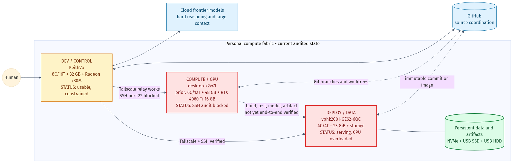

# Heterogeneous Compute Fabric

A three-machine personal compute fabric for agentic coding, local AI, batch work, persistent services, and storage. The design distributes **jobs** across machines; it does not try to combine heterogeneous hardware into one virtual computer or one distributed model.

## Current operating model

| Logical role | Current host | Best use | Current gate |
| --- | --- | --- | --- |
| `dev` | `KeithVo` | Human-facing control, editing, planning, light tests | Usable; low free memory and 100 Mbps active Ethernet observed |
| `compute` (`gpu` compatibility name) | `desktop-x2w7f` | Light coding, CPU/RAM builds and tests, CUDA, local models | Tailscale-visible; SSH audit blocked |
| `deploy` | `vphk2001-GE62-6QC` | Persistent services, databases, storage, staging | Serving, but currently overloaded by interactive compute |

The important correction from the initial handoff is that `desktop-x2w7f` is a **hybrid compute node**. Its i5-12400F and 48 GB RAM are useful even when a task does not need the RTX 4060 Ti.

## Start here

- [Current architecture and workload routing](docs/architecture.md)
- [Read-only audit — 2026-08-27](docs/audits/2026-08-27-three-machine-audit.md)
- [DEV inventory](inventory/dev.md)
- [COMPUTE inventory](inventory/compute.md)
- [DEPLOY inventory](inventory/deploy.md)
- [Original handoff](handoff.md)

## Near-term gates

1. Restore and verify read-only SSH access to `desktop-x2w7f` without changing it during this audit.
2. Establish documented aliases (`dev`, `compute`/`gpu`, `deploy`) after access is explicitly authorized.
3. Remove interactive development and heavy test pressure from `deploy` before assigning it more work.
4. Prefer wired networking for artifact transfer; both remote Tailscale probes currently relay rather than connect directly.
5. Prove one Git-based `dev -> compute -> deploy` workflow before adding a scheduler.
