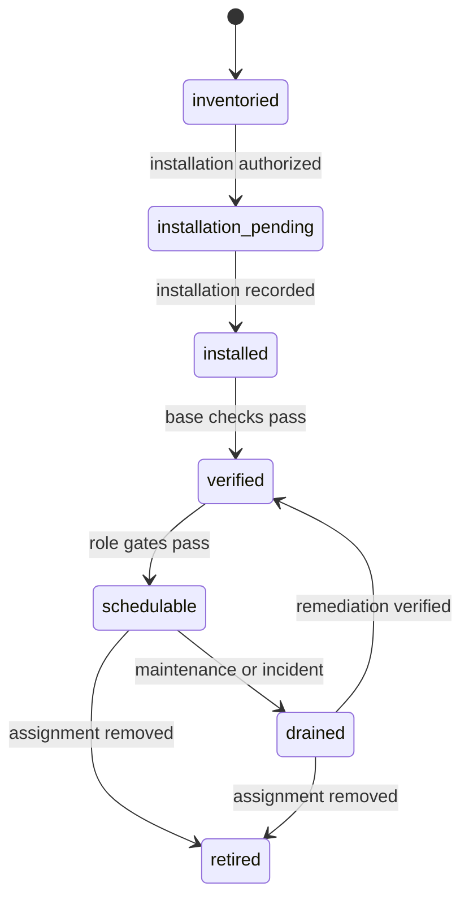

# Architecture

## System model



The fabric separates four responsibilities:

1. a **development/control node** owns interactive work and coordination;
2. a **compute node** executes bounded CPU, memory, and accelerator workloads;
3. a **cloud node** supplies architecture-aware remote or elastic capacity;
4. a **deployment/data node** prioritizes persistent services, data, and recovery.

These are [node archetypes](nodes.md), not a public inventory of real machines. A deployment can assign zero, one, or many Node Slots to each archetype.

## Identity layers

```text
Node Slot          stable logical identity       <purpose>-<ordinal>
  -> Archetype      public responsibility         development / compute / cloud / deploy
  -> Hardware       private assignment            physical or virtual capacity
  -> Installation   disposable state              OS, drivers, tools, configuration
  -> Operations     restricted mapping            access, ownership, services, evidence
```

Public coordination uses the Node Slot and archetype. Hardware, installation, and operational mappings stay access-controlled.

## Control and data flow

A work request declares required capabilities and acceptance criteria. The control function compares that contract with admitted node roles, selects an eligible Node Slot, and records an immutable result.

```text
work request -> capability match -> admitted node -> immutable result -> review
                                                                  -> deployment gate
```

Source control coordinates changes. Artifact storage carries build outputs, reports, datasets, and images. No workflow depends on multiple agents editing one shared writable checkout.

## Workload routing



| Workload class | Preferred archetype | Typical gates |
| --- | --- | --- |
| Interactive editing and short feedback loops | Development/control | installation health, user-session capacity |
| CPU or memory-intensive build and test | Compute | architecture, resource budget, bounded execution |
| Accelerator workload | Compute | accelerator compatibility, runtime verification, thermals |
| Architecture-specific remote work | Cloud | architecture, cost, ownership, storage, recovery |
| Persistent service or database | Deployment/data | service owner, capacity, backup, restore, rollback |
| Artifact retention | Deployment/data or declared storage role | integrity, retention, ownership, restore evidence |

Routing fails closed when no candidate satisfies every required capability and gate. Manual selection is sufficient until measured demand proves a scheduler is necessary.

## Admission lifecycle



Admission is role-aware. A node can be ready for CPU work while an accelerator role remains gated. Live admission state belongs to the private implementation plane, not this repository.

## Public/private boundary

| Public concept plane | Private implementation plane |
| --- | --- |
| Node archetypes and logical naming | Real hardware and cloud assignments |
| Capability and admission concepts | Current admission evidence and state |
| Abstract routing and artifact flow | Scheduler, CLI, automation, and source code |
| Lifecycle and security principles | Hostnames, addresses, users, services, and access paths |
| Architecture decisions | Configuration, runbooks, owners, and recovery locations |

Credentials belong in a credential store, not in either repository.

## Scaling

- Add capacity within an archetype by incrementing the ordinal.
- Add an archetype only when it introduces a distinct responsibility or policy boundary.
- Permit multiple eligible nodes for a workload; choose using current private evidence.
- Keep workload granularity above device-level tensor or memory operations unless a homogeneous, measured use case proves otherwise.
