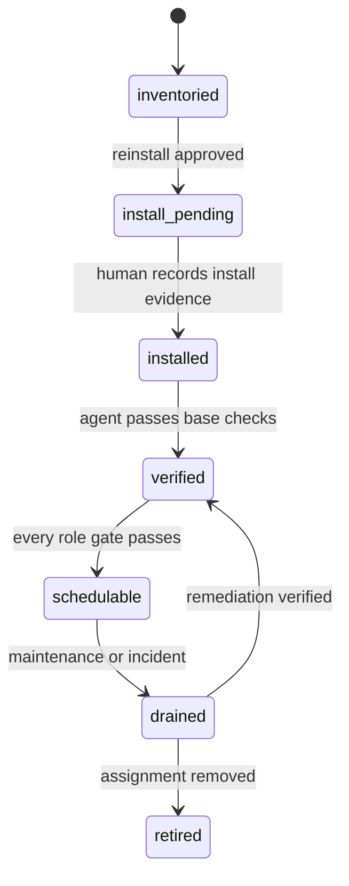
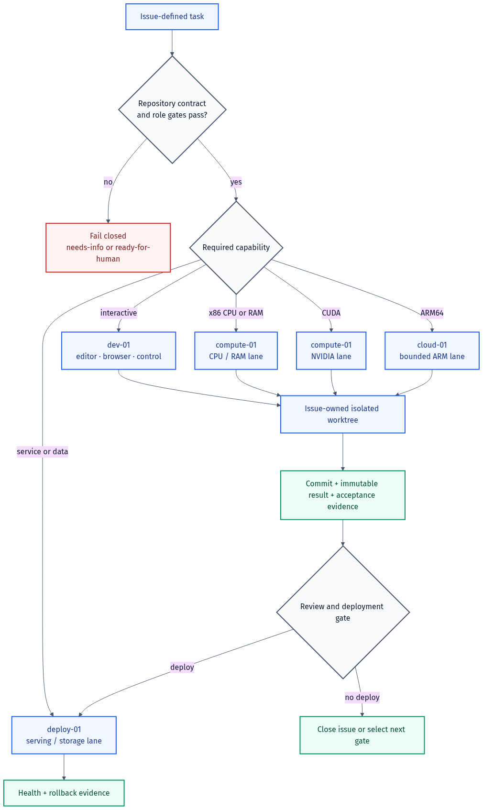

# Architecture and workload routing

## Identity model

```text
Node Slot          stable public identity       compute-01
  -> Hardware      replaceable assignment       x86 CPU + NVIDIA GPU
  -> Installation  disposable operating state  ubuntu24
  -> Private map   restricted connection data   hostname/user/address
```

The Node Slot is the coordination unit. Hardware and installations can change without forcing issue, label, or runbook renames.

## Four current Node Slots

### `dev-01`

The interactive control and development workstation. Route planning, editing, browser work, Git coordination, and short feedback loops here. Do not assume it has spare memory or use it as a persistent service host without a fresh snapshot gate.

### `compute-01`

A hybrid worker with three independent capacity lanes:

- CPU lane for x86_64 builds, tests, data preparation, and light coding;
- RAM lane for memory-heavy tooling and larger build/test jobs;
- CUDA lane for NVIDIA inference, GPU tests, and compatible model workloads.

A task need not use the GPU to be suitable for `compute-01`.

### `cloud-01`

An ARM64 cloud worker for bounded agents, architecture-compatible builds, and auxiliary services. Treat cost status, workload ownership, storage headroom, and recovery evidence as gates. Cloud allocation is capacity, not proof that a task is free to run.

### `deploy-01`

The persistent service, staging, database, and storage node. Serving continuity has priority over interactive compute. New work requires owner and resource-budget checks.

## Public and private control planes

The public repository contains:

- stable Node Slots and roles;
- durable hardware capacity with field-level evidence;
- OS Profile policy and admission gates;
- repository compatibility contracts;
- sanitized diagrams and runbooks.

The private operations overlay contains:

- current hostname and private-network identity;
- SSH user and public-key authorization state;
- owners, services, recovery locations, and live utilization;
- credential references, but never raw secrets.

An agent needs the public contract to decide **where** work belongs and authorized private data to decide **how** to connect.

## Linux baseline

`ubuntu24` remains the v1 baseline for `compute-01` and a supported workstation profile for `dev-01`. It minimizes bootstrap branches and follows explicit Docker and NVIDIA support paths.

`ubuntu26` is the selected workstation-only profile for `dev-01`. It requires exact Ubuntu 26.04 admission evidence and does not broaden the COMPUTE profile. `pop24` remains a supported workstation-only alternative with its separate bootstrap and acceptance report. Fedora can interoperate over Tailscale, SSH, Git, and containers, but is experimental for this fabric until it has an owned profile and current vendor-support evidence.

Mixed distributions do not break communication. They increase operational variance in package management, security defaults, driver packaging, upgrades, and troubleshooting.

## Admission lifecycle



State is stored in `inventory/nodes.yaml`. GitHub triage labels describe issue readiness; they do not replace node admission state.

## Workload routing



| Workload | Preferred node | Required gates |
| --- | --- | --- |
| Interactive editing and browser work | `dev-01` | workstation profile, free-memory snapshot |
| x86_64 CPU build or test | `compute-01` | base verification, bounded resource budget |
| CUDA test or inference | `compute-01` | driver, `nvidia-smi`, host smoke test, GPU-container smoke test |
| ARM64 build or agent | `cloud-01` | architecture compatibility, cost/owner/storage gates |
| Persistent service or database | `deploy-01` | service owner, backup/restore, capacity budget, rollback |
| Immutable artifact storage | declared storage target | owner, integrity, retention, restore evidence |

## Source and artifact flow

```text
issue -> isolated worktree -> commit -> eligible worker -> immutable result
      -> review -> deployment issue -> deploy-01 -> health and rollback evidence
```

- Git coordinates source; do not synchronize live writable trees.
- Every active writer owns an issue-linked branch and isolated worktree.
- A repository contract declares architectures and required roles.
- Deployment consumes a commit or immutable image, not another node's working directory.

## Scaling rules

- Add capacity inside an existing purpose as the next ordinal, for example `compute-02`.
- Add a new purpose with a new series, for example `storage-01` or `gateway-01`.
- A GitHub task may carry several `node:<node-id>` labels when multiple nodes are suitable.
- Keep scheduling manual until one end-to-end pilot exposes a concrete automation problem.

