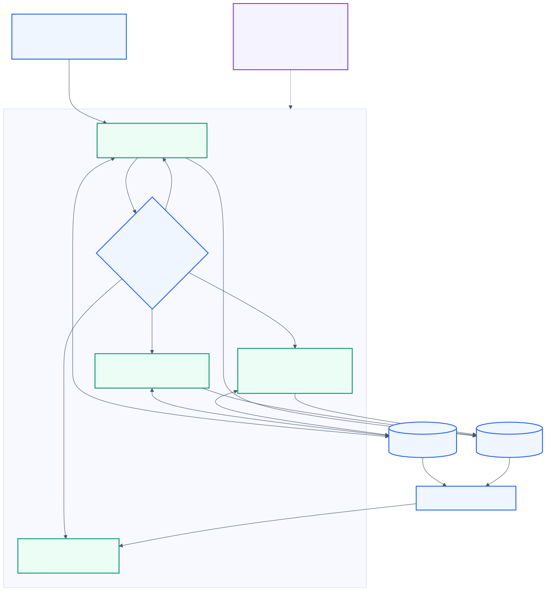
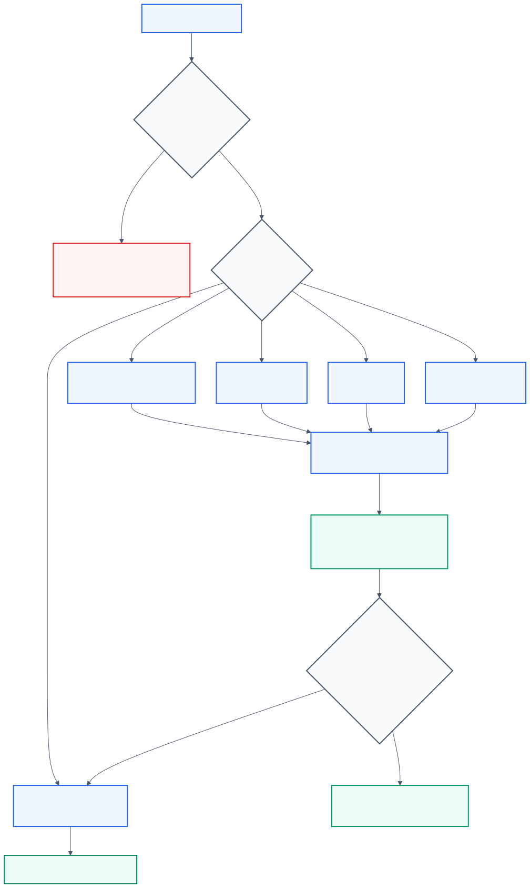

# Architecture

## System model



The current fabric separates four responsibilities:

1. `dev-01` owns interactive development and coordination;
2. `compute-01` executes bounded CPU, memory, and CUDA workloads;
3. `cloud-01` supplies ARM64 remote capacity;
4. `deploy-01` prioritizes persistent services, data, artifacts, and recovery.

The [node specifications](nodes.md) publish planning-safe hardware facts. Hardware assignments remain replaceable; access identities and live operations stay private.

## Identity layers

```text
Node Slot          stable logical identity       <purpose>-<ordinal>
  -> Archetype      public responsibility         development / compute / cloud / deploy
  -> Hardware       public-safe capacity summary  CPU, memory, accelerator, storage
  -> Installation   private disposable state      OS, drivers, tools, configuration
  -> Operations     restricted mapping            access, ownership, services, evidence
```

Public coordination uses the Node Slot, archetype, and sanitized capacity. Installation and operational mappings stay access-controlled.

## Control and data flow

A work request declares required capabilities and acceptance criteria. The control function compares that contract with admitted node roles, selects an eligible Node Slot, and records an immutable result.

Source control coordinates changes. Artifact storage carries build outputs, reports, datasets, and images. No workflow depends on multiple agents editing one shared writable checkout.

## Workload routing



| Workload class | Preferred node | Typical gates |
| --- | --- | --- |
| Interactive editing and short feedback loops | `dev-01` | installation health, user-session capacity |
| CPU or memory-intensive build and test | `compute-01` | architecture, resource budget, bounded execution |
| CUDA workload | `compute-01` | accelerator compatibility, runtime verification, thermals |
| ARM64 remote work | `cloud-01` | architecture, cost, ownership, storage, recovery |
| Persistent service or database | `deploy-01` | service owner, capacity, backup, restore, rollback |
| Artifact retention | `deploy-01` or another declared storage role | integrity, retention, ownership, restore evidence |

Routing fails closed when no candidate satisfies every required capability and gate. Manual selection is sufficient until measured demand proves a scheduler is necessary.

## Admission lifecycle


Admission is role-aware. A node can be ready for CPU work while an accelerator role remains gated. Live admission evidence belongs to the private implementation plane, not this repository.

## Public/private boundary

| Public concept plane | Private implementation plane |
| --- | --- |
| Node Slots, archetypes, and logical naming | Hostnames, addresses, users, and access paths |
| Sanitized CPU, memory, GPU, storage, and historical aggregate activity summaries | Current installation details and live utilization |
| Capability and admission concepts | Current admission evidence and authoritative state |
| Abstract routing and artifact flow | Scheduler, CLI, automation, and source code |
| Lifecycle and security principles | Configuration, services, runbooks, owners, and recovery locations |

Credentials and API keys belong in a credential store, not in either repository.

## Evaluation

The published capacity is nominal inventory with documentation evidence dated **2026-08-28**, not a fresh hardware verification or pooled performance. The [measurement coverage table](../README.md#measurement-coverage) links the available [sanitized historical workflow activity dataset](https://github.com/Kitkitkittt/ci-capacity-patterns/blob/main/docs/diagrams/activity-snapshot.json) and [historical execution case study](https://github.com/Kitkitkittt/ci-capacity-patterns/blob/main/docs/SOURCES.md#3-what-we-verified-ourselves-and-what-we-did-not). Workflow conclusions do not establish execution placement or utilization, and historical timing samples do not establish improvement. Hardware and comparable end-to-end benchmarks remain unmeasured; live utilization and admission evidence stay in the private implementation plane.

## Scaling

- Add capacity within an archetype by incrementing the ordinal.
- Add an archetype only when it introduces a distinct responsibility or policy boundary.
- Permit multiple eligible nodes for a workload; choose using current private evidence.
- Keep workload granularity above device-level tensor or memory operations unless a homogeneous, measured use case proves otherwise.
